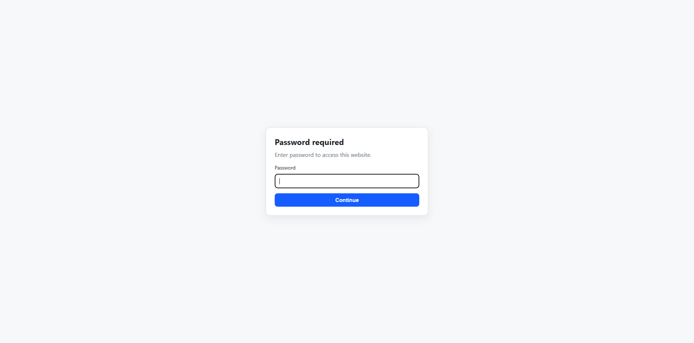
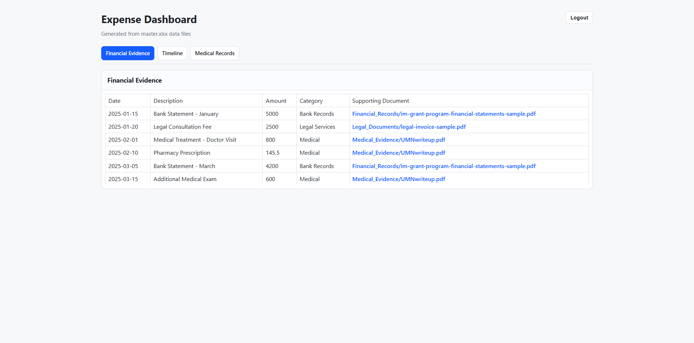
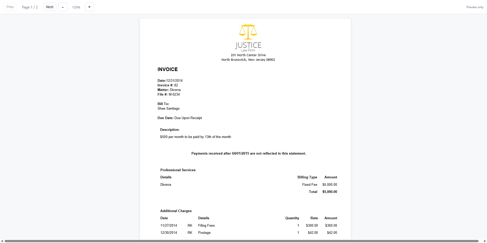

# EvidenceVault  - Secure Legal Evidence Dashboard

A password-protected web application for organizing, cataloging, and presenting legal evidence and financial documentation for court proceedings. This system ensures controlled access to sensitive materials through encryption and authentication.

## Purpose

This repository contains a secure, self-hosted dashboard designed specifically for managing court-related documentation. It provides:

- **Centralized Evidence Repository**: Organize all legal documents, financial statements, and evidence in one secure location
- **Controlled Access**: Password-protected site ensures only authorized individuals can view sensitive materials
- **Professional Presentation**: Convert complex financial data into organized, readable formats for legal review
- **Evidence Preservation**: Maintain an immutable record of all documentation with timestamps and organization
- **Search and Navigation**: Easily locate specific documents and evidence by category and date

## Technology Stack

- **Hugo**: Static site generator for fast, secure hosting
- **Node.js**: Conversion scripts for data processing
- **Cloudflare Pages**: Serverless hosting with built-in authentication middleware
- **XLSX Processing**: Convert Excel data into organized web content

---

## Screenshots

### 1. Password Authentication
All access to your evidence dashboard is protected by a password. When users visit the site, they're prompted to enter the password before accessing any content.



### 2. Evidence Dashboard
After authentication, users see an organized dashboard displaying all your evidence, organized by category. Each sheet from your Excel file becomes a separate tab. Click on evidence links to view supporting documents.



### 3. PDF Preview
Clicking on any evidence file opens a secure preview page. PDFs display in a sandboxed environment with:
- Print prevention (Ctrl+P disabled)
- No direct download capability
- Full read-only access
- Session-based authentication



---

## Setup Instructions for Cloudflare Pages

### Prerequisites

- Node.js (v16+) installed locally
- Cloudflare account (free tier is sufficient)
- Git repository (GitHub, GitLab, or similar)
- Hugo installed locally (for development)

### Step 1: Prepare Your Local Repository

1. Clone or create your repository:
```bash
git clone <your-repo-url>
cd leonid-court
```

2. Install dependencies:
```bash
npm install
```

3. Test the build locally:
```bash
npm run build
```

This should complete without errors and generate JSON files in the `/data` folder.

### Step 2: Configure Your Excel File

Your master Excel file (`master/master.xlsx`) should be structured as follows:

#### File Location
- Place your Excel file in the `master/` folder at the root of your repository
- Filename: `master.xlsx`
- The conversion script will automatically read from this location

#### Excel Workbook Structure

**Each Sheet Represents a Category**
- Sheet names become JSON files and categories (e.g., "Medical Expenses" → `medical.json`)
- Each sheet should have a consistent table structure

**Sheet Layout Requirements**

Row 1: **Headers**
- Use descriptive column names
- Examples: "Date", "Description", "Amount", "Category", "Document Link", "Notes"
- Headers are automatically normalized (converted to lowercase, spaces to underscores)

Rows 2+: **Data Rows**
- Each row represents an expense, document, or evidence entry
- Leave rows blank if not needed (they'll be skipped during conversion)

**Flexibility in Structure**

You can structure your Excel file **however you like** to match your specific needs. The conversion script is flexible and will process any table layout. Examples of different structures:

- **Financial Tracking**: Date, Description, Amount, Category, Supporting Document
- **Timeline of Events**: Date, Event, Parties, Location, Evidence File, Notes
- **Medical Records**: Date, Provider, Treatment, Cost, Insurance Status, Document
- **Correspondence Log**: Date, From, To, Subject, Document, Status
- **Custom Structure**: Any columns that make sense for your case

**Critical Requirement: PDF File Links**

The only requirement is that you **must include columns with links to your PDF files**. Examples:

- Reference a PDF: `Financial_Records/Invoice_2025.pdf`
- Reference multiple PDFs: `Evidence/Document_1.pdf`

These file paths are essential because:
- They generate preview pages automatically
- They create the clickable links in your dashboard
- They organize access to your supporting evidence
- Without them, rows have no attached documentation

**Example File Referencing Styles**:

1. **Date Columns**
   - Format as standard date format (MM/DD/YYYY or similar)
   - Will be automatically converted to ISO format (YYYY-MM-DD)

2. **Text Columns**
   - Descriptions, notes, categories
   - Support any text content

3. **Currency/Number Columns**
   - Amounts, totals, quantities
   - Format as numbers in Excel
   - Can use number formats like currency ($)

4. **Link/File Columns**
   - Used to reference PDF files, invoices, or evidence documents
   - Format: relative file paths like `Invoices/2025.01.15_Receipt.pdf`
   - Files referenced should exist in the `master/` folder structure
   - Links are converted to preview pages automatically

5. **Hyperlink Columns**
   - Create Excel hyperlinks for external references
   - Right-click cell → Link → add URL
   - Internal references use format: `#SheetName!CellReference`

#### Example Excel Structure

```
Sheet: "Medical Expenses"
┌─────────┬──────────────────────────────┬────────┬─────────────────────┐
│ Date    │ Description                  │ Amount │ Evidence File       │
├─────────┼──────────────────────────────┼────────┼─────────────────────┤
│ 1/15/25 │ Doctor Consultation          │ 250.00 │ Medical/Invoice.pdf │
│ 2/20/25 │ Prescription Medication      │ 85.50  │ Medical/Rx_2025.pdf │
│ 3/10/25 │ Lab Tests and Analysis       │ 350.00 │ Medical/Lab_2025.pdf│
└─────────┴──────────────────────────────┴────────┴─────────────────────┘
```

#### File Organization Inside Master Folder

Your `master/` folder should be organized like:

```
master/
├── master.xlsx                 (main data file)
├── Invoices/
│   ├── 2025.01.15_Receipt.pdf
│   └── 2025.02.20_Invoice.pdf
├── Medical/
│   ├── Invoice.pdf
│   └── Rx_2025.pdf
├── Legal/
│   ├── Correspondence.pdf
│   └── Court_Documents.pdf
└── Evidence/
    └── Supporting_Documentation.pdf
```

Referenced file paths in Excel should match this structure exactly. For example, if you reference `Invoices/2025.01.15_Receipt.pdf` in your Excel file, the actual file must exist at `master/Invoices/2025.01.15_Receipt.pdf`.

### Step 3: Configure Cloudflare Pages

#### 3.1 Connect Your Repository

1. Log in to [Cloudflare Dashboard](https://dash.cloudflare.com)
2. Go to **Pages** (in the sidebar under "Workers & Pages")
3. Click **Create a project**
4. Select **Connect to Git**
5. Authorize Cloudflare to access your Git provider
6. Select your repository

#### 3.2 Configure Build Settings

1. **Framework**: Select "Hugo"
2. **Build command**: `npm run build`
3. **Build output directory**: `public`
4. **Node version**: 18+ (set in Environment Variables if needed)

#### 3.3 Set Environment Variables

This is critical for security. Environment variables are never exposed publicly.

1. After connecting your repository, go to **Settings** → **Environment Variables**
2. Add the following variables:

**Production Environment:**
- Key: `SITE_PASSWORD`
- Value: *(your strong password - this will be required to access the site)*

**Example values to avoid:**
- Don't use simple passwords like "password" or "123456"
- Recommended: Use a strong password with 12+ characters, including uppercase, lowercase, numbers, and symbols
- Example: `Secure$Evidence2025#Legal`

3. Click **Save**

#### 3.4 Deploy

1. Cloudflare will automatically detect your changes when you push to your connected Git branch
2. The build will run automatically:
   - Node scripts will convert your Excel file to JSON
   - Hugo will generate the static site
   - Files will be deployed to Cloudflare's CDN

3. Once deployment is complete, your site will be available at:
   - `https://<project-name>.pages.dev`
   - Or at a custom domain if you've configured one

### Step 4: Custom Domain (Optional)

1. In Cloudflare Pages, go to your project
2. Click **Custom domains**
3. Add your domain and follow DNS configuration steps
4. Cloudflare will automatically issue an SSL certificate

---

## Local Development

### Development Workflow

1. **Update your Excel file** in `master/master.xlsx`
2. **Run the conversion**:
   ```bash
   node scripts/convert.js
   ```
   This generates JSON files from your Excel data.

3. **Run Hugo locally**:
   ```bash
   hugo server
   ```
   Visit `http://localhost:1313` to preview your site.

4. **Or run the complete build**:
   ```bash
   npm run build
   ```

### File Structure

```
project-root/
├── master/                    # Excel files and supporting evidence
│   ├── master.xlsx           # Main data file (REQUIRED)
│   └── [category folders]    # Supporting documents
├── data/                      # Generated JSON files (auto-created)
├── layouts/                   # Hugo templates
├── static/                    # Static assets (CSS, JS, images)
├── public/                    # Generated site output
├── scripts/
│   └── convert.js            # Conversion script (Excel → JSON)
├── functions/
│   └── _middleware.js        # Cloudflare authentication middleware
├── hugo.toml                 # Hugo configuration
└── package.json              # Project dependencies
```

---

## Security Features

### Password Protection

- All pages require password authentication
- 2-hour session timeout for inactivity
- Secure HMAC-SHA256 token signing
- HttpOnly, Secure cookies prevent JavaScript access
- Direct file downloads are blocked

### PDF Previews

- PDFs are displayed in sandboxed preview mode
- Direct PDF navigation is disabled
- Users cannot download files directly
- All access is logged through Cloudflare

### Print Prevention

- The system actively prevents printing via **Ctrl+P** and **Cmd+P**
- Print dialog is intercepted and blocked at the application level
- Print stylesheets are disabled to prevent workarounds
- A message displays if users attempt to print: "Printing is disabled."
- This ensures evidence documentation remains in the controlled environment
- Screenshots and screen captures are still possible (not technically preventable)
- For legitimate printing needs, consult with legal representatives

### Hosting Security

- Cloudflare DDoS protection
- SSL/TLS encryption in transit
- Static site (no databases or backend vulnerabilities)
- Automatic security updates via Cloudflare

---

## Maintenance

### Updating Evidence

1. Update your `master/master.xlsx` file with new evidence
2. Add any new supporting documents to the appropriate folders in `master/`
3. Commit and push changes to your Git repository:
   ```bash
   git add .
   git commit -m "Update evidence documentation"
   git push
   ```
4. Cloudflare Pages will automatically rebuild and deploy

### Changing Password

1. Go to Cloudflare Pages → **Settings** → **Environment Variables**
2. Update the `SITE_PASSWORD` value
3. Save changes
4. The site will redeploy automatically

### Troubleshooting Build Failures

Check the build logs in Cloudflare Pages:
1. Go to **Deployments**
2. Click the failed deployment
3. View **Build log** for error details

Common issues:
- Excel file not found: Ensure `master/master.xlsx` exists
- Missing dependencies: Run `npm install` before pushing
- File path errors: Verify referenced files exist in `master/` folder

---

## Important Notes

### Data Privacy

- Your entire site is **static** - no data is sent to external servers
- Authentication happens at the Cloudflare edge level
- Excel data is only converted during build time
- Once deployed, the original Excel file is not accessible publicly

### Backups

- Keep regular backups of your `master/` folder
- Your Git repository serves as version control
- Consider maintaining a backup of your Excel file separately

### Legal Considerations

- This tool is designed to organize evidence for legal proceedings
- Ensure all documentation is properly authenticated and legally obtained
- Consult with your legal representative about documentation requirements
- Maintain chain of custody principles for all evidence

---

## Support & Troubleshooting

### Common Issues

**"Missing linked file" warnings during build:**
- Normal if your Excel references files that don't exist yet
- These won't break the build or deployment

**Password not working after update:**
- Clear your browser cookies and try again
- Environment variables take effect on next deployment

**Excel conversion errors:**
- Ensure Excel file is properly formatted (headers in first row)
- Verify no circular references or complex formulas
- Try saving as `.xlsx` format explicitly

For additional help, consult:
- [Hugo Documentation](https://gohugo.io/documentation/)
- [Cloudflare Pages Docs](https://developers.cloudflare.com/pages/)
- [Node.js XLSX Library](https://github.com/SheetJS/sheetjs)

---

## License

Designed for legal evidence management and court proceedings. Use responsibly and in accordance with local laws and regulations.

**Last Updated**: May 2026
